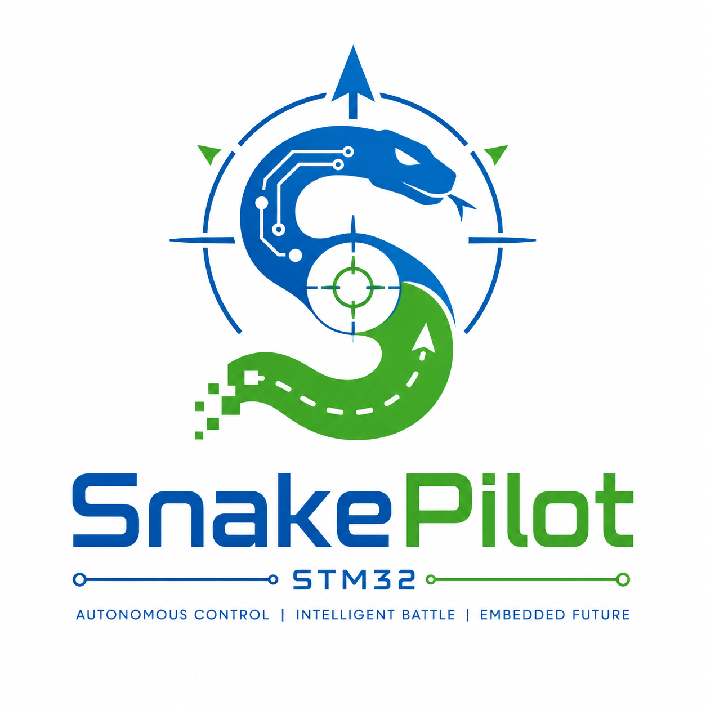
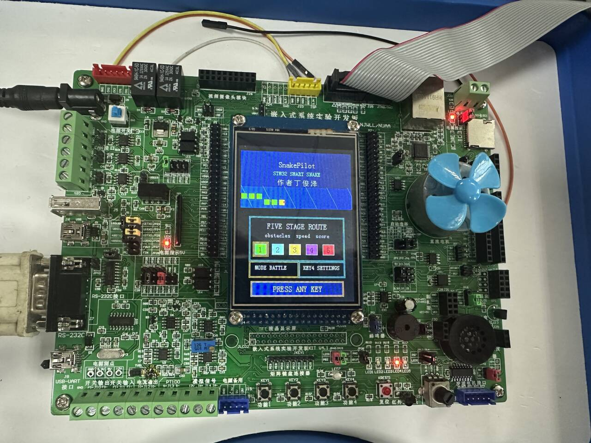

# SnakePilot
SnakePilot 是一个基于 STM32F107VC 的嵌入式贪吃蛇交互系统。项目围绕 NUAA_CM3_107 实验开发板完成，集成 LCD 图形界面、GPIO 按键、ADC 旋钮、USART1 串口键盘、片内 Flash 数据保存、DAC/DMA/TIM 音频、LED 状态提示，以及多关卡、多模式、开放地图、双人对战和 Battle AI 竞技玩法。
<p align="center">
  
</p>


工程使用 STM32F10x 标准外设库 V3.5.0，提供 Keil MDK-ARM 工程、VS Code EIDE 工程配置和 PC 端 Battle 可视化仿真器。固件主体已完成并可直接编译、下载到开发板运行。
<p align="center">
  
</p>

## 作者

丁俊泽 鲁贇涛 何力

## 使用说明与学术诚信声明

> [!IMPORTANT]
> 本仓库代码以 MIT License 开源。考虑到本项目对应的课程设计验收周期为 2026 年 5 月 20 日至 2026 年 6 月 20 日，在该时间段内，请南京航空航天大学相关课程同学不要将本项目代码、报告、界面设计或功能实现用于课程设计或答辩展示，请 **独立完成**，请 **独立完成**，请 **独立完成**，验收之前**不接受**任何二次开发行为。

上述说明用于维护课程设计期间的学术诚信和评价公平性。2026 年 6 月 20 日之后，欢迎在遵守 MIT License 的前提下学习、参考、修改和二次开发本项目，并建议在使用时注明来源。

## 项目概况

项目主体运行在 STM32F107VCT6 上，LCD 采用 240 x 320 竖屏显示方式。常规游戏视图为 15 x 20 网格，每个格子宽 13 像素、高 12 像素；开放地图为 40 x 56 网格，Battle 模式为 80 x 80 世界并在屏幕中显示跟随玩家的 15 x 20 视口。程序启动后进入 SnakePilot 首页，用户可以通过 ADC 旋钮选择起始关卡，通过 USART1 串口命令切换模式，并通过板载按键或串口命令进入游戏、调节设置和查看排行榜。

项目功能包括：

- LCD 图形界面：显示首页、关卡选择、模式选择、设置页、排行榜、状态栏、游戏地图、分数、生命值、最高分、倒计时和 Battle HUD。
- 六种游戏模式：阶段闯关、经典填图、双人对战、开放地图、开放地图双人对战、Battle AI 竞技。
- 五关地图机制：基础地图、障碍地图、传送门地图、道具地图和限时地图。
- 游戏逻辑：蛇身队列、食物生成、碰撞检测、传送门跳转、关卡推进、胜负判定、生命值管理、暂停、重开和返回首页。
- 多种食物：普通食物、毒食物、奖励食物；Battle 模式另有普通豆和尸体豆。
- 多通道交互：GPIO 四方向键、ADC 旋钮、USART1 串口键盘命令共同控制游戏。
- 排行榜：按模式保存并展示历史前 5 名分数。
- Flash 持久化：最高分、音量、默认模式和各模式排行榜写入片内 Flash，复位或断电后保留。
- 声光反馈：LED 指示移动方向或 Battle 刷新状态，DAC Channel 2 输出提示音和背景旋律。
- 首页动效：SnakePilot 首页与排行榜页带有装饰蛇动画。
- 显示优化：常规模式局部刷新，开放地图视口跟随蛇头，Battle 模式按移动包围盒刷新，减少残影和闪烁。
- 动态节奏：普通模式随分数和关卡提高移动速度，Battle 模式支持 10/15/30 FPS 渲染节奏和加速机制。
- PC 端仿真：`Sim/battle_sim.py` 使用 Tkinter 提供 Battle 可视化预览，便于在没有开发板时调试玩法、AI 行为和显示效果。

## 硬件平台

| 项目 | 配置 |
| --- | --- |
| 开发板 | NUAA_CM3_107 实验开发板 |
| MCU | STM32F107VCT6 |
| 内核 | ARM Cortex-M3 |
| Flash 配置 | IROM 起始地址 `0x08000000`，大小 `0x40000` |
| Flash 数据页 | `0x0803F800`，用于保存设置和排行榜 |
| SRAM 配置 | IRAM 起始地址 `0x20000000`，大小 `0x10000` |
| LCD | 3.2 寸 TFT LCD，16 位并行 IO 驱动，竖屏 240 x 320 |
| 调试/下载 | ST-Link，SWD 接口 |
| 固件库 | STM32F10x Standard Peripheral Library V3.5.0 |
| 工具链 | ARMCC5 / Keil MDK-ARM / VS Code EIDE |

## 外设与引脚分配

### 按键

四个低电平有效的 GPIO 输入作为方向键和页面快捷键。

| 功能 | GPIO |
| --- | --- |
| 上 / KEY1 | PD11 |
| 下 / KEY2 | PD12 |
| 左 / KEY3 | PC13 |
| 右 / KEY4 | PA0 |
| 暂停/继续 | 同时按下 PD11 与 PD12 |
| Battle 加速 | 同时按下 PC13 与 PA0 |

首页按键分工：

- `KEY1(PD11)` / `KEY2(PD12)`：按当前选择开始游戏。
- `KEY3(PC13)`：进入排行榜页。
- `KEY4(PA0)`：进入设置页。

排行榜页中，旋钮用于切换模式，任意方向键返回首页。设置页中，旋钮用于调节音量，任意方向键返回首页。结束页、胜利页、对战结果页或暂停页中，`KEY1(PD11)` 返回首页。

### USART1 串口

USART1 接收 PC 端串口键盘命令，参数为 115200 bps、8 数据位、1 停止位、无校验、无硬件流控。接收中断只负责解析输入并写入命令队列，游戏主循环再统一消费命令。

| 功能 | 配置 |
| --- | --- |
| USART 外设 | USART1 |
| TX | PA9 |
| RX | PA10 |
| 波特率 | 115200 |
| 数据格式 | 8N1 |
| 中断 | USART1 RXNE |

### LED

| LED | GPIO | 游戏含义 |
| --- | --- | --- |
| LED1 | PD2 | 当前方向为上 |
| LED2 | PD3 | 当前方向为下 |
| LED3 | PD4 | 当前方向为左 |
| LED4 | PD7 | 当前方向为右 |
| LED5 | PB7 | Battle 模式帧刷新指示 |

### LCD

LCD 使用 16 位并行数据总线，主要连接如下：

| 信号 | GPIO |
| --- | --- |
| DB0 - DB15 | PE0 - PE15 |
| LCD_CS | PC6 |
| LCD_RS | PD13 |
| LCD_WR | PD14 |
| LCD_RD | PD15 |
| LCD_LED | PB14 |

`User/Lcd/lcd.c` 提供 LCD 初始化、清屏、窗口设置、画点、画线、矩形填充和字符串显示。游戏界面中的地图格子、首页卡片、状态栏、排行榜、Battle HUD 和提示文字都建立在这些绘图函数之上。

### ADC 旋钮

| 功能 | 配置 |
| --- | --- |
| ADC 外设 | ADC1 |
| 通道 | ADC_Channel_3 |
| GPIO | PA3 |

旋钮在不同界面承担不同作用：

- 首页：将 0-4095 的 ADC 读数划分为 5 段，用于选择起始关卡。
- 普通游戏中：检测 ADC 值相对变化，转化为向左或向右的相对转向事件。
- 暂停状态：左右旋转切换关卡并保持暂停。
- 设置页：将 ADC 读数映射为 0-5 档音量。
- 排行榜页：切换当前查看的游戏模式。
- Battle 模式：控制玩家相对转向。

### 音频输出

音频使用 `TIM3 + DAC Channel 2 + DMA2_Channel4` 输出 32 点正弦波。程序根据音符频率动态调整 TIM3 自动重装载值，由 TIM3 更新事件触发 DAC 输出，DMA 循环搬运波形表，从而形成提示音和背景旋律。

| 功能 | 配置 |
| --- | --- |
| DAC 输出 | DAC Channel 2 |
| 输出引脚 | PA5 |
| 定时器触发 | TIM3 TRGO |
| DMA 通道 | DMA2_Channel4 |
| 波形表 | 32 点正弦波 |
| 音量范围 | 0-5 |

`PC0` 蜂鸣器 GPIO 在硬件初始化中保留，主要音效由 PA5 的 DAC 波形输出。

## 软件结构

克隆仓库后，以仓库根目录作为工作目录。`Project` 目录保存 Keil/EIDE 工程配置，业务源码主要在 `User` 目录中，PC 端 Battle 仿真器位于 `Sim` 目录。

```text
SnakePilot
├── Doc
│   └── information.txt                  # 原实验说明，来源于 TIMx 定时器示例
├── Libraries
│   ├── CMSIS                            # Cortex-M3 和 STM32F10x CMSIS 支持
│   └── STM32F10x_StdPeriph_Driver_v3.5  # STM32F10x 标准外设库
├── Project
│   ├── Project.uvprojx                  # Keil MDK 工程
│   ├── Project.code-workspace           # VS Code 工作区
│   ├── .eide/eide.yml                   # EIDE 工程配置
│   ├── .vscode/tasks.json               # 构建、下载、清理任务
│   └── build                            # 构建产物目录
├── Sim
│   ├── README.md                        # Battle 仿真器说明
│   └── battle_sim.py                    # Tkinter Battle 可视化仿真器
├── User
│   ├── Battle
│   │   ├── battle_core.c                # Battle 模式规则核心
│   │   └── battle_core.h                # Battle 数据结构和接口
│   ├── Main
│   │   ├── main.c                       # SnakePilot 主程序、UI、游戏模式和外设调度
│   │   ├── hw_config.c/.h               # GPIO、LED、按键、蜂鸣器等基础硬件配置
│   │   ├── stm32f10x_it.c/.h            # 中断入口，包含 USART1 中断转发
│   │   ├── stm32f10x_conf.h             # 标准外设库头文件配置
│   │   ├── array.h                      # 资源数组头文件
│   │   └── DS18B20.c/.h                 # 温度传感器驱动，工程中保留
│   ├── Lcd
│   │   ├── lcd.c/.h                     # 当前游戏使用的 LCD 驱动
│   │   ├── font.h                       # 字库数据
│   │   ├── pic.h                        # 图片资源/显示相关头文件
│   │   └── NUAA107_32_Driver_IO16.*     # 开发板 LCD 示例驱动
│   ├── Uart
│   │   ├── snake_uart.c                 # USART1 初始化、接收中断解析和命令队列
│   │   └── snake_uart.h                 # 串口命令类型与接口声明
│   └── Timer
│       ├── Timer.c
│       └── Timer.h                      # 延时函数和课程定时器示例代码
├── logo.png                             # 项目形象图
├── LICENSE
└── README.md
```

## 主要源码说明

### `User/Main/main.c`

这是项目的核心文件，包含游戏配置、地图数据、音乐数据、输入处理、Flash 持久化、音频输出、LCD 绘制和主循环。

重要配置项包括：

| 配置项 | 当前值 | 说明 |
| --- | --- | --- |
| `GRID_COLS` | 15 | 常规屏幕视图列数 |
| `GRID_ROWS` | 20 | 常规屏幕视图行数 |
| `CELL_W` | 13 | 每个地图格子的显示宽度 |
| `CELL_H` | 12 | 每个地图格子的显示高度 |
| `OPEN_WORLD_COLS` | 40 | 开放地图实际列数 |
| `OPEN_WORLD_ROWS` | 56 | 开放地图实际行数 |
| `LEVEL_COUNT` | 5 | 普通关卡数量 |
| `GAME_MODE_COUNT` | 6 | 游戏模式数量 |
| `RANKING_TOP_COUNT` | 5 | 每个模式排行榜条目数 |
| `MAX_SNAKE_LEN` | 2240 | 普通/开放地图蛇身最大长度 |
| `VOLUME_MAX` | 5 | 最大音量档位 |
| `SNAKE_FLASH_STORE_ADDR` | `0x0803F800` | Flash 持久化记录地址 |

主要函数职责如下：

| 函数 | 作用 |
| --- | --- |
| `Snake_ShowHome()` | 绘制首页、播放首页音乐、处理选关、模式选择和进入设置/排行榜 |
| `Snake_ShowRanking()` | 绘制排行榜页，按模式显示历史前 5 名分数并支持旋钮切换 |
| `Snake_ShowSettings()` | 设置页，使用旋钮或串口调节音量 |
| `Snake_StartGame()` | 初始化分数、生命值并进入起始关卡或 Battle 模式 |
| `Snake_StartLevel()` | 初始化指定关卡的地图状态、时间、音乐、蛇身和食物 |
| `Snake_HandleSerialInput()` | 从串口命令队列中取出命令并映射为游戏操作 |
| `Snake_HandleInput()` | 扫描按键、旋钮和串口命令，处理方向、暂停和暂停时切关 |
| `Snake_Step()` | 执行单人模式下一步移动和规则判断 |
| `Snake_DuoStep()` | 执行双人模式下两条蛇的同步移动、碰撞与胜负判定 |
| `Snake_BattleStart()` | 初始化 Battle 模式状态、视口、帧率、皮肤和渲染缓存 |
| `Snake_BattleLoop()` | 运行 Battle 模式输入、AI、规则更新、渲染和持久化 |
| `Snake_PlaceFood()` | 在空白格中生成食物，并按当前模式生成普通、毒性或奖励食物 |
| `Snake_ApplyFood()` | 根据食物类型更新分数、生命值和关卡进度 |
| `Snake_Render()` | 重绘状态栏、地图、食物和蛇身 |
| `Snake_RenderStep()` | 在视口不变时局部刷新，减少整屏重绘 |
| `Snake_WaitReturnHome()` | 在结束页、胜利页或对战结果页等待 KEY1 或串口 R 返回首页 |
| `Snake_AudioInit()` | 初始化 DAC、DMA、TIM3 和音频波形表 |
| `Snake_MusicTick()` | 推进背景音乐播放 |
| `Snake_PersistLoad()` / `Snake_PersistSave()` | 从片内 Flash 读取/写入设置、最高分和排行榜 |

主循环位于 `main()` 中，整体流程为：

```text
系统初始化
  -> GPIO 初始化
  -> ADC 旋钮初始化
  -> USART1 初始化
  -> DAC/DMA/TIM3 音频初始化
  -> LCD 初始化
  -> Flash 持久化数据读取
  -> 显示首页并选择起始关卡和游戏模式
  -> 初始化游戏
  -> 循环等待下一步移动
       -> 处理按键、旋钮、串口、音乐和倒计时
       -> 按当前模式执行单人、双人、开放地图或 Battle 逻辑
       -> 根据结果处理死亡、掉血、过关、通关、对战胜负或 Battle 复活
```

### `User/Battle/battle_core.c/.h`

该模块保存 Battle 模式的独立规则核心。Battle 世界大小为 80 x 80，包含 1 名玩家和 4 条 AI 蛇，最多维护 192 个豆子，目标保持 128 个普通豆。普通移动间隔为 95 ms，加速移动间隔为 55 ms；蛇身长度大于 7 时才能加速，每 4 次加速移动消耗 1 节身体并掉落普通豆。

Battle 规则特性：

- 吃普通豆加 1 分并增长 1 节。
- 死亡蛇按身体路径掉落尸体豆，尸体豆价值 2 分。
- 撞到世界边界、其他蛇身体或与其他蛇头对撞会死亡。
- 死亡后 2 秒在安全位置复活，分数保留。
- AI 会根据目标豆子价值、距离、墙体距离和其他蛇身体进行简单寻路决策。
- Battle 规则核心由固件直接调用，PC 端仿真器保留同类玩法的桌面预览实现，便于对比调试。

### `User/Uart/snake_uart.c/.h`

该模块负责 USART1 的 GPIO、串口参数和 RXNE 中断配置。接收到普通字符时，会将 W/A/S/D、P、空格、R、1-5 转换为内部命令；接收到 ANSI 方向键转义序列时，会转换为二号玩家方向命令。解析后的命令进入 8 项环形队列，由主循环统一消费。

### `User/Lcd/lcd.c/.h`

LCD 驱动提供底层寄存器写入、GRAM 写入、窗口设置、清屏、区域填充、字符串显示和基本图形绘制。SnakePilot 没有引入额外 GUI 框架，地图格子、状态栏、菜单、排行榜和 Battle 动画都直接调用这些基础绘图函数完成。

### `User/Main/hw_config.c/.h`

该模块完成基础 GPIO 初始化和硬件宏定义，主要包括 LED、按键、蜂鸣器、位带访问宏等。游戏入口 `main()` 调用 `GPIO_Configuration()` 初始化 LED 输出、方向键输入和蜂鸣器 GPIO。

### `User/Timer/Timer.c/.h`

该文件保留课程实验中的定时器示例代码，并提供 `Delay_ms()` 延时函数。游戏节拍通过短延时循环推进；音频部分单独使用 TIM3 作为 DAC 触发源。

### `Sim/battle_sim.py`

PC 端 Battle 可视化仿真器，使用 Python 内置 Tkinter，无需第三方依赖。窗口以 2 倍比例显示 240 x 320 LCD 预览，可在电脑上调试 Battle 规则、AI 行为、皮肤和渲染节奏。

## 游戏规则

### 游戏模式

首页模式区域支持 6 种模式：

| 模式 | 说明 |
| --- | --- |
| STAGE | 默认闯关模式，按照五个关卡的目标分推进，第 5 关带 45 秒限时 |
| CLASSIC | 经典填图模式，使用当前选择的关卡地图，不按目标分过关，蛇身填满可行走区域后胜利 |
| DUO | 双人对战模式，两条蛇在同一张关卡地图中同步移动，碰撞后显示 P1/P2 胜利或平局 |
| OPEN | 单人开放地图模式，地图扩展为 40 x 56 网格，屏幕视口跟随蛇头移动 |
| OPENDUO | 开放地图双人模式，屏幕分成 P1、P2 两个小视口，分别跟随两名玩家的蛇头 |
| BATTLE | 80 x 80 Battle 世界，1 名玩家对抗 4 条 AI 蛇，支持加速、复活、尸体豆和皮肤切换 |

在 STAGE 和 CLASSIC 模式中，生命值、最高分和食物效果完整生效；在 DUO 和 OPENDUO 模式中，界面主要显示 P1、P2 分数，核心目标变为对战存活和得分；OPEN 和 OPENDUO 使用动态生成的边界、障碍和传送门；BATTLE 使用独立规则核心和跟随视口。

### 关卡设计

| 关卡 | 名称 | 目标 | 特点 |
| --- | --- | --- | --- |
| 1 | BASIC | 吃到 3 个目标分 | 空地图，用于熟悉操作 |
| 2 | WALL | 吃到 4 个目标分 | 出现固定障碍物，撞墙或撞障碍会掉生命 |
| 3 | PORTAL | 吃到 4 个目标分 | 地图中存在 A/B 传送门，进入一个传送门会从另一个传送门出现 |
| 4 | ITEM | 吃到 6 个目标分 | 混合普通食物、毒食物和奖励食物 |
| 5 | TIME | 吃到 5 个目标分 | 45 秒限时挑战，超时会掉生命 |

普通关卡地图由 `level_map` 二维字符矩阵描述：

| 字符 | 含义 |
| --- | --- |
| `.` | 空白格 |
| `#` | 固定障碍物 |
| `A` | 传送门 A |
| `B` | 传送门 B |

### 食物、生命值与分数

| 食物类型 | 显示颜色 | 效果 |
| --- | --- | --- |
| 普通食物 | 红色 | 分数 +1，关卡进度 +1，蛇身增长 |
| 毒食物 | 品红色 | 分数最多 -1，生命值 -1，蛇身不增长 |
| 奖励食物 | 青色 | 分数 +2，关卡进度 +2，生命值最多增加到 5 |
| Battle 普通豆 | 多色小点 | Battle 分数 +1，蛇身增长 1 节 |
| Battle 尸体豆 | 高亮小点 | Battle 分数 +2，蛇身增长 2 节 |

普通模式初始生命值为 3。撞到边界、障碍物或自身时损失 1 点生命；STAGE 模式限时关倒计时归零也会损失生命。生命值未归零时继续当前关卡；生命值归零时显示 `GAME OVER`。蛇头撞到自身时，被撞部位到蛇尾之间的整段蛇身会消失，并同步扣减长度和分数。

双人模式中，两名玩家各自维护蛇身和得分。任一玩家发生碰撞时，系统根据死亡情况显示 `P1 WINS`、`P2 WINS` 或 `DRAW`。Battle 模式中玩家和 AI 死亡后会掉落尸体豆并在 2 秒后复活，分数保留。

最高分、音量、默认模式和各模式排行榜都会写入片内 Flash，断电或复位后保留。

### 速度调节

普通模式的移动间隔由 `Snake_StepDelay()` 计算。初始间隔约为 300 ms，分数越高间隔越短；第 4、5 关会额外缩短移动间隔，最低约为 110 ms。Battle 模式使用 95 ms 普通步进和 55 ms 加速步进，渲染节奏可在 10/15/30 FPS 之间切换。

## 操作说明

### 首页

1. 转动旋钮选择起始关卡，首页下方高亮当前关卡。
2. 串口 `W`/`S` 切换游戏模式，`A`/`D` 或数字 `1`-`5` 选择关卡。
3. 按 KEY1 或 KEY2 从当前选择开始游戏；按 KEY3 进入排行榜页；按 KEY4 进入设置页。
4. 串口端按空格开始游戏，按 `P` 进入设置页。

### 排行榜页

1. 转动旋钮切换当前查看的游戏模式。
2. 屏幕按名次从高到低显示该模式历史前 5 名分数。
3. 按任意物理方向键返回首页；串口端按 `R` 返回首页。

### 设置页

1. 转动旋钮调整音量，范围为 0-5。
2. 串口端使用 `A`/`D` 降低或提高音量。
3. 按任意方向键返回首页；串口端按空格、`P` 或 `R` 返回首页。

### 普通游戏、开放地图和双人模式

| 板载操作 | 效果 |
| --- | --- |
| PD11 | P1 向上移动 |
| PD12 | P1 向下移动 |
| PC13 | P1 向左移动 |
| PA0 | P1 向右移动 |
| PD11 + PD12 | 暂停或继续 |
| 旋钮左转 | 相对当前方向左转 |
| 旋钮右转 | 相对当前方向右转 |
| 暂停时旋钮左/右转 | 切换关卡，保持暂停状态 |

| 串口输入 | 效果 |
| --- | --- |
| `W` / `A` / `S` / `D` | 控制 P1 上、左、下、右移动 |
| 方向键 | 控制 P2 上、左、下、右移动 |
| `1` / `2` / `3` / `5` | 双人模式下控制 P2 左、下、右、上移动 |
| `1` - `5` | 单人模式暂停时切换到对应关卡 |
| 空格或 `P` | 暂停或继续 |
| `R` | 重新开始当前游戏；在暂停页、排行榜页、结束页、胜利页或对战结果页返回首页 |

按键扫描带有消抖处理，并通过转向锁限制每个移动步长内每名玩家只接受一次转向。程序会拒绝直接反向移动，降低误操作造成的自碰撞。

### Battle 模式

| 操作 | 效果 |
| --- | --- |
| PD11 / PD12 / PC13 / PA0 | 控制玩家上、下、左、右移动 |
| 旋钮左转/右转 | 相对当前方向左转/右转 |
| PC13 + PA0 | 玩家加速 |
| PD11 + PD12 | 暂停或继续 |
| 暂停时 KEY1 | 返回首页 |
| 串口 `W` / `A` / `S` / `D` | 控制玩家方向 |
| 串口空格或 `P` | 暂停或继续 |
| 串口 `R` | 返回首页并记录分数 |
| 串口 `1` / `2` / `3` | 切换 10 / 15 / 30 FPS |
| 串口 `4` / `5` | 切换经典蛇皮肤 / Nailoong 风格龙皮肤 |

Battle HUD 显示玩家分数、玩家长度、AI 总分、当前 FPS、皮肤和状态信息。

## PC 端 Battle 仿真器

`Sim/battle_sim.py` 可在电脑上运行 Battle 可视化调试窗口，使用 Python 内置 Tkinter，无需安装第三方包。

从仓库根目录运行：

```bash
python Sim/battle_sim.py
```

仿真器窗口以 2 倍比例显示 240 x 320 LCD 预览，默认进入 1 名玩家 + 4 条 AI 蛇的 Battle 预览。

| 按键 | 动作 |
| --- | --- |
| W/A/S/D | 控制 P1 |
| 方向键 | 双人预览中控制 P2 |
| Left/Right Shift | P1 加速 |
| Enter | 双人预览中 P2 加速 |
| Space | 暂停/继续 |
| F | 切换 15/30 FPS 渲染节奏 |
| R | 重开比赛 |
| 1 | 单人预览 |
| 2 | 1 名玩家 + 4 条 AI |
| 3 | 双人 Battle 预览 |
| K | 切换玩家皮肤 |
| 4 | 经典皮肤 |
| 5 | Nailoong 风格龙皮肤 |

## 构建与下载

### 使用 Keil MDK

1. 安装 Keil MDK-ARM，建议使用 V5.15 或更高版本。
2. 安装 STM32F1xx Device Family Pack。工程文件中记录的 Pack 为 `Keil.STM32F1xx_DFP.2.4.0`，同系列较新版本通常也可兼容 STM32F107VC。
3. 打开 `Project/Project.uvprojx`。
4. 确认目标为 `TIMx应用-更新中断实验`，芯片为 `STM32F107VC`。
5. 编译工程，生成 AXF/HEX 文件。
6. 通过 ST-Link 连接开发板，下载程序并复位运行。

### 使用 VS Code + EIDE

1. 安装 VS Code。
2. 安装推荐插件：EIDE、Cortex-Debug、C/C++、Serial Monitor 等。
3. 打开 `Project/Project.code-workspace`。
4. 在 VS Code 用户设置或 EIDE 插件设置中配置本机 Keil/ARMCC5、ST-Link、OpenOCD 等工具路径。仓库配置不写入个人电脑上的绝对路径。
5. 在 VS Code 任务中运行 `build` 进行编译。
6. 使用 `flash` 或 `build and flash` 下载到开发板。

构建产物默认输出到：

```text
Project/build/Debug/Project.axf
Project/build/Debug/Project.hex
Project/build/Debug/Project.map
```

如果普通下载失败，可以使用 VS Code 任务中的 `flash recover stlink`。该任务会调用 PATH 中的 `STM32_Programmer_CLI`，并使用 `mode=UR reset=HWrst` 方式尝试恢复下载。

## EIDE 工程配置摘要

`.eide/eide.yml` 中的主要配置如下：

| 配置项 | 当前值 |
| --- | --- |
| 工程类型 | ARM |
| 设备 | STM32F107VC |
| 工具链 | AC5 |
| CPU | Cortex-M3 |
| 浮点 | none |
| C 标准 | C99 |
| 优化等级 | level-0 |
| MicroLIB | 启用 |
| ROM Base | `0x08000000` |
| RAM Base | `0x20000000` |
| 下载器 | STLink |
| STLink 接口 | SWD |
| OpenOCD Target | `stm32f1x` |

Keil/EIDE 工程当前包含的主要源文件包括：

- `../User/Main/main.c`
- `../User/Main/stm32f10x_it.c`
- `../User/Main/hw_config.c`
- `../User/Battle/battle_core.c`
- `../User/Uart/snake_uart.c`
- `../User/Lcd/lcd.c`
- `../User/Timer/Timer.c`
- `../Libraries/CMSIS/CoreSupport/core_cm3.c`
- `../Libraries/CMSIS/DeviceSupport/system_stm32f10x.c`
- `../Libraries/CMSIS/DeviceSupport/Startup/startup_stm32f10x_cl.s`
- 标准外设库中的 GPIO、RCC、ADC、DAC、DMA、EXTI、TIM、USART、misc 等模块

工程包含路径已覆盖 `User/Main`、`User/Battle`、`User/Lcd`、`User/Timer`、`User/Uart` 和 STM32F10x 标准外设库目录。

## 调试建议

- 如果 LCD 无显示，先检查 LCD 并行数据线和控制线是否与 `lcd.h` 中定义一致，再确认背光 PB14 是否拉高。
- 如果按键无响应，确认四个方向键是否为低电平有效，并检查 PD11、PD12、PC13、PA0 是否被其他模块占用。
- 如果旋钮选关异常，可以在 `Snake_ReadAdcChannel()` 附近临时显示 ADC 值，检查 PA3 输入是否在 0-4095 范围内变化。
- 如果串口控制无响应，先确认串口工具连接 USART1 的 PA9/PA10，参数为 115200、8N1、无流控，再检查工程是否包含 `User/Uart/snake_uart.c` 和标准外设库的 `stm32f10x_usart.c`。
- 如果设置或排行榜无法保存，确认 IROM 范围包含 `0x0803F800` 所在页，并避免其他程序占用该 Flash 页。
- 如果没有声音，优先检查 PA5 是否接入音频输出电路，同时确认设置页音量不是 0。
- 如果 Battle 模式出现明显残影，可先切换到 10/15 FPS 验证是否与 LCD 刷新速度有关。
- 如果 ST-Link 下载失败，可以降低 SWD 频率，或使用 `flash recover stlink` 任务进行硬复位下载。
- 如果 Keil 或 EIDE 报找不到头文件，检查包含路径是否包含 `Libraries/CMSIS/CoreSupport`、`Libraries/CMSIS/DeviceSupport`、`Libraries/STM32F10x_StdPeriph_Driver_v3.5/inc` 和 `User/Main`、`User/Battle`、`User/Lcd`、`User/Timer`、`User/Uart`。

## 许可证

本项目使用 MIT License，详见 `LICENSE`。

## 贡献者

感谢以下成员对 SnakePilot 的设计、开发、测试和文档完善所做的贡献。

<table>
  <tbody>
    <tr>
      <td align="center">
        <a href="https://github.com/dengdeng55525">
          
          <br />
          <sub><b>DengDeng</b></sub>
        </a>
      </td>
      <td align="center">
        <a href="https://github.com/AusungSi">
          
          <br />
          <sub><b>AusungSi</b></sub>
        </a>
      </td>
      <td align="center">
        <a href="https://github.com/Helicopterrrrrrr">
          
          <br />
          <sub><b>Helicopterrrrrrr</b></sub>
        </a>
      </td>
    </tr>
  </tbody>
</table>
